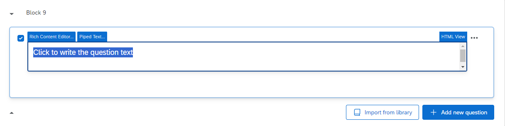

# SRET-in-Qualtrics

This repository contains the instructions and code for implementing a **Self-Referential Encoding Task (SRET)** designed to be embedded into Qualtrics surveys.

For any questions, please open new issues on this repository - and if you wish to contribute to the documentation or fix any errors, feel free to make a pull request.

Click [me](https://nus.syd1.qualtrics.com/jfe/form/SV_agC0U7DchyvX4Tc) to see an example!

## Task Overview

**Procedure:**

- Participants complete 57 word trials total (5 practice + 52 main task)
- Each trial shows a fixation cross (600-1000ms) followed by a single word
- Participants press **Q** if the word describes them, **P** if it does not
- Main task includes 26 positive words and 26 negative words
- Practice phase includes feedback on response speed

**Measures:**

- Self-endorsement patterns (which positive/negative words participants accept as self-descriptive)
- Response times for self-referential decisions
- Practice performance and speed feedback

## Embedding Instructions

The Self-Referential Encoding Task can be embedded into a Qualtrics survey following the steps below.

### Adding the Task as a Question

To begin, create a new block in your survey by clicking **"Add Block"**.


After that, create a new question by clicking **"+ Add new question"**.


Once you click on the **"+ Add new question"** button, a dropdown will appear. Select the **"Text / Graphic"** option.


This will result in a template question, as shown below.


From here, hover above the **"Click to write the question text"**, and click on it. This should show you several more options.



From here, click on **"HTML View"** at the right corner. The following popup will appear.


Copy-and-paste the code in `code/index.html` into this box, and then click **"Save"**.


Once you have done so, the question should now look like this.


### Adding the SRET Task Code

Now, go to the left navigation bar. You should see several options like below (if you do not see them, try clicking on the question once more). Here, click on **"JavaScript"**.


The following popup will appear.


Delete all the code in here, copy-and-paste the code in `original.js` into this box, and then click **"Save"**.


The code has been embedded successfully!

### Adding the Embedded Data

Now, the last thing to tackle is the data recording process. Go to the left navigation bar once more, and this time click on the second icon. This will take you to the **"Survey flow"** page.


The **"Survey flow"** page should look something like this. This is an example taken from a pre-existing survey; the question names were crossed out for privacy purposes.


Here, there should be a block for your SRET Task. On the block containing your SRET Task, click on **"Add Below"**.


This will popup.


Here, click on **"Embedded Data"**.


This will be the result of clicking on **"Embedded Data"**.


Here, what you need to do is to create 12 separate data entries named:

- `sret_participant_id`
- `sret_main_words`
- `sret_main_valences`
- `sret_main_responses`
- `sret_main_endorsements`
- `sret_main_response_times`
- `sret_practice_words`
- `sret_practice_responses`
- `sret_practice_endorsements`
- `sret_practice_response_times`
- `sret_positive_endorsed_count`
- `sret_negative_endorsed_count`
- `sret_average_response_time`
- `sret_total_trials_completed`

When you do this, Qualtrics will automatically log these data, and it will be accessible through its `.csv` data file export. After you have included all data fields, it should look similar to this:


Remember to click on **"Apply"** at the bottom of the page.

And you're all set! Head back to the survey tab, and publish the survey.


## Data Output

The experiment collects the following data:

**Participant Data:**

- `sret_participant_id`: Participant identifier (from Qualtrics or auto-generated)

**Practice Phase Data:**

- `sret_practice_words`: Words shown during practice (semicolon separated)
- `sret_practice_responses`: Key responses ('q' or 'p', semicolon separated)
- `sret_practice_endorsements`: Whether word was endorsed (true/false, semicolon separated)
- `sret_practice_response_times`: Response times in milliseconds (semicolon separated)

**Main Task Data:**

- `sret_main_words`: All 52 words shown (semicolon separated)
- `sret_main_valences`: Word valences ('positive' or 'negative', semicolon separated)
- `sret_main_responses`: Key responses ('q' or 'p', semicolon separated)
- `sret_main_endorsements`: Whether word was endorsed (true/false, semicolon separated)
- `sret_main_response_times`: Response times in milliseconds (semicolon separated)

**Summary Statistics:**

- `sret_positive_endorsed_count`: Number of positive words endorsed (0-26)
- `sret_negative_endorsed_count`: Number of negative words endorsed (0-26)
- `sret_average_response_time`: Average response time in milliseconds
- `sret_total_trials_completed`: Total number of main trials completed

**Response Key Mapping:**

- `q`: Word **does** describe me (endorsement = true)
- `p`: Word **does not** describe me (endorsement = false)

## Advanced Instructions

The code for the Self-Referential Encoding Task is contained inside `original.js` file.

**Customizing Word Lists:**

To modify word lists, locate the `practice_stimuli` (line 286) and `test_stimuli` (line 295). Each word follows this format:

**Practice words:**

```js
{ stimulus: 'young', trialtype: 'practice'}
```

**Main task words:**

```js
{ stimulus: 'happy', valence: 'positive', trialtype: 'block'}
```

- `stimulus`: The word presented to participants
- `valence`: Word valence ('positive' or 'negative')
- `trialtype`: Trial type ('practice' or 'block')

**Customizing Timing:**

- Fixation cross duration: Randomly selected from `[600, 700, 800, 900, 1000]` ms (line 356)
- Word display: No time limit by default (participants respond at their own pace)
- Speed feedback thresholds: <300ms (too fast) and >2000ms (too slow) in practice phase

**Customizing Response Keys:**

- Current mapping: Q = "describes me", P = "does not describe me"
- To change keys: modify the `choices: ['q', 'p']` parameter in the `sret_trial` object (around line 373)
